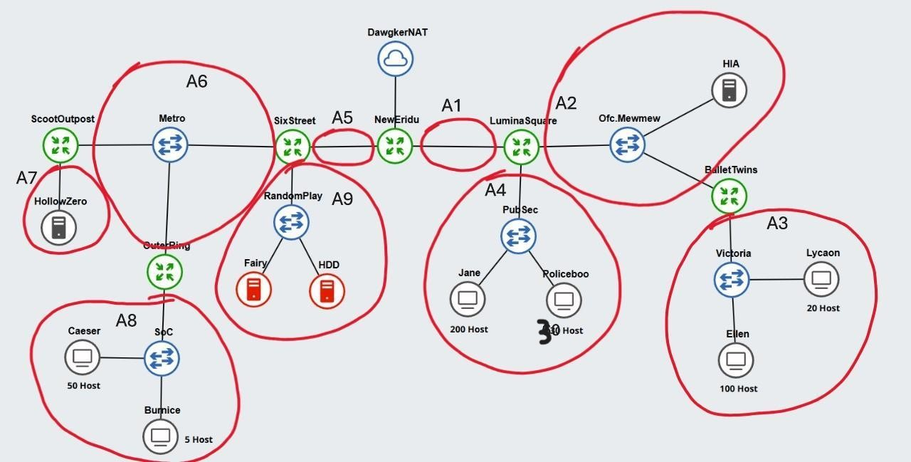

# Jarkom-Modul-5-IT26-2024
**Salsabila Rahmah (5027231005)** <br>
**Rafael Ega Krisaditya (5027231025)**
## Topologi Jaringan dan Pembagian Subnet


## Tree


## Spreadsheet Pembagian IP Subnet
[Spreadsheet Pembagian IP Subnet](https://docs.google.com/spreadsheets/d/1RsyGUHDkX6PORwnmuhoLswWwZUOwpgX8823EpeLFQxM/edit?usp=sharing)

## Network Configuration
### NewEridu
```
#NAT
auto eth0
iface eth0 inet dhcp

#A1
auto eth1
iface eth1 inet static
	address 192.246.2.217
	netmask 255.255.255.252

#A5
auto eth2
iface eth2 inet static
	address 192.246.2.221
	netmask 255.255.255.252
```

### LuminaSquare
```
#A1
auto eth0
iface eth0 inet static
	address 192.246.2.218
	netmask 255.255.255.252
    gateway 192.246.2.217

#A2
auto eth1
iface eth1 inet static
	address 192.246.2.193
	netmask 255.255.255.248

#A4
auto eth2
iface eth2 inet static
	address 192.246.1.1
	netmask 255.255.255.0
```

### BalletTwins
```
#A2
auto eth0
iface eth0 inet static
	address 192.246.2.195
	netmask 255.255.255.248
    gateway 192.246.2.193

#A3
auto eth1
iface eth1 inet static
	address 192.246.2.1
	netmask 255.255.255.128
```

### SixStreet
```
#A5
auto eth0
iface eth0 inet static
	address 192.246.2.222
	netmask 255.255.255.252
    gateway 192.246.2.221

#A6
auto eth2
iface eth2 inet static
	address 192.246.2.201
	netmask 255.255.255.248

#A9
auto eth1
iface eth1 inet static
	address 192.246.2.209
	netmask 255.255.255.248
```

### ScootOutpost
```
#A6
auto eth0
iface eth0 inet static
	address 192.246.2.203
	netmask 255.255.255.248
    gateway 192.246.2.201

#A7
auto eth1
iface eth1 inet static
	address 192.246.2.225
	netmask 255.255.255.252
```

### OuterRing
```
#A6
auto eth0
iface eth0 inet static
	address 192.246.2.202
	netmask 255.255.255.248
    gateway 192.246.2.201

#A8
auto eth1
iface eth1 inet static
	address 192.246.2.129
	netmask 255.255.255.192
```

### HIA
```
auto eth0
iface eth0 inet static
	address 192.246.2.194
	netmask 255.255.255.248
    gateway 192.246.2.193
```

### HDD
```
auto eth0
iface eth0 inet static
	address 192.246.2.210
	netmask 255.255.255.248
    gateway 192.246.2.209
```

### Fairy
```
auto eth0
iface eth0 inet static
	address 192.246.2.211
	netmask 255.255.255.248
    gateway 192.246.2.209
```

### HollowZero
```
auto eth0
iface eth0 inet static
	address 192.246.2.226
	netmask 255.255.255.252
    gateway 192.246.2.225
```

### Client (Caesar, Burnice, Jane, Policeboo, Ellen, Lycaon)
```
auto eth0
iface eth0 inet dhcp
```

## .bashrc + routing
### NewEridu
```bash
#A2
route add -net 192.246.2.192 netmask 255.255.255.248 gw 192.246.2.218

#A3
route add -net 192.246.2.0 netmask 255.255.255.128 gw 192.246.2.218

#A4
route add -net 192.246.1.0 netmask 255.255.255.0 gw 192.246.2.218

#A6
route add -net 192.246.2.200 netmask 255.255.255.248 gw 192.246.2.222

#A7
route add -net 192.246.2.224 netmask 255.255.255.252 gw 192.246.2.222

#A8
route add -net 192.246.2.128 netmask 255.255.255.192 gw 192.246.2.222

#A9
route add -net 192.246.2.208 netmask 255.255.255.248 gw 192.246.2.222

#Otomasi iptables awal
IP_ETH0=$(ip -4 addr show eth0 | grep -oP '(?<=inet\s)\d+(\.\d+){3}')
iptables -t nat -A POSTROUTING -o eth0 -j SNAT --to-source $IP_ETH0
```

### LuminaSquare (DHCP Relay)
```bash
#A3
route add -net 192.246.2.0 netmask 255.255.255.128 gw 192.246.2.195

#A7
route add -net 192.246.2.224 netmask 255.255.255.252 gw 192.246.2.217

#A8
route add -net 192.246.2.128 netmask 255.255.255.192 gw 192.246.2.217

#A9
route add -net 192.246.2.208 netmask 255.255.255.248 gw 192.246.2.217

echo 'nameserver 192.168.122.1' > /etc/resolv.conf
apt-get update
apt install isc-dhcp-relay -y

echo 'SERVERS="192.246.2.211"
INTERFACES="eth0 eth1 eth2 eth3"
OPTIONS=""
' > /etc/default/isc-dhcp-relay

echo 'net.ipv4.ip_forward=1' >> /etc/sysctl.conf

service isc-dhcp-relay restart
```

### BalletTwins (DHCP Relay)
```bash
#A4
route add -net 192.246.1.0 netmask 255.255.255.0 gw 192.246.2.193

#A7
route add -net 192.246.2.224 netmask 255.255.255.252 gw 192.246.2.193

#A8
route add -net 192.246.2.128 netmask 255.255.255.192 gw 192.246.2.193

#A9
route add -net 192.246.2.208 netmask 255.255.255.248 gw 192.246.2.193

echo 'nameserver 192.168.122.1' > /etc/resolv.conf
apt-get update
apt install isc-dhcp-relay -y

echo 'SERVERS="192.246.2.211"
INTERFACES="eth0 eth1 eth2 eth3"
OPTIONS=""
' > /etc/default/isc-dhcp-relay

echo 'net.ipv4.ip_forward=1' >> /etc/sysctl.conf

service isc-dhcp-relay restart
```

### SixStreet (DHCP Relay)
```bash
#A2
route add -net 192.246.2.192 netmask 255.255.255.248 gw 192.246.2.221

#A3
route add -net 192.246.2.0 netmask 255.255.255.128 gw 192.246.2.221

#A4
route add -net 192.246.1.0 netmask 255.255.255.0 gw 192.246.2.221

#A7
route add -net 192.246.2.224 netmask 255.255.255.252 gw 192.246.2.203

#A8
route add -net 192.246.2.128 netmask 255.255.255.192 gw 192.246.2.202

echo 'nameserver 192.168.122.1' > /etc/resolv.conf
apt-get update
apt install isc-dhcp-relay -y

echo 'SERVERS="192.246.2.211"
INTERFACES="eth0 eth1 eth2 eth3"
OPTIONS=""
' > /etc/default/isc-dhcp-relay

echo 'net.ipv4.ip_forward=1' >> /etc/sysctl.conf

service isc-dhcp-relay restart
```

### OuterRing (DHCP Relay)
```bash
#A2
route add -net 192.246.2.192 netmask 255.255.255.248 gw 192.246.2.201

#A3
route add -net 192.246.2.0 netmask 255.255.255.128 gw 192.246.2.201

#A4
route add -net 192.246.1.0 netmask 255.255.255.0 gw 192.246.2.201

#A7
route add -net 192.246.2.224 netmask 255.255.255.252 gw 192.246.2.203

#A9
route add -net 192.246.2.208 netmask 255.255.255.248 gw 192.246.2.201

echo 'nameserver 192.168.122.1' > /etc/resolv.conf
apt-get update
apt install isc-dhcp-relay -y

echo 'SERVERS="192.246.2.211"
INTERFACES="eth0 eth1 eth2 eth3"
OPTIONS=""
' > /etc/default/isc-dhcp-relay

echo 'net.ipv4.ip_forward=1' >> /etc/sysctl.conf

service isc-dhcp-relay restart
```

### ScootOutpost
```bash
#A2
route add -net 192.246.2.192 netmask 255.255.255.248 gw 192.246.2.201

#A3
route add -net 192.246.2.0 netmask 255.255.255.128 gw 192.246.2.201

#A4
route add -net 192.246.1.0 netmask 255.255.255.0 gw 192.246.2.201

#A8
route add -net 192.246.2.128 netmask 255.255.255.192 gw 192.246.2.202

#A9
route add -net 192.246.2.208 netmask 255.255.255.248 gw 192.246.2.201

echo 'nameserver 192.168.122.1' > /etc/resolv.conf
```

### Fairy (DHCP Server)
```bash
echo 'nameserver 192.168.122.1' > /etc/resolv.conf
apt-get update
apt-get install isc-dhcp-server netcat -y

echo 'INTERFACESv4="eth0"' > /etc/default/isc-dhcp-server

echo '#A8
subnet 192.246.2.128 netmask 255.255.255.192 {
        range 192.246.2.130 192.246.2.190;
        option routers 192.246.2.129; # Gateway
        option broadcast-address 192.246.2.191;
        option domain-name-servers 192.246.2.210; #IP HDD
        default-lease-time 600;
        max-lease-time 7200;
}

#A4
subnet 192.246.1.0 netmask 255.255.255.0 {
        range 192.246.1.2 192.246.1.254;
        option routers 192.246.1.1;
        option broadcast-address 192.246.1.255;
        option domain-name-servers 192.246.2.210;
        default-lease-time 600;
        max-lease-time 7200;
}

#A3
subnet 192.246.2.0 netmask 255.255.255.128 {
        range 192.246.2.2 192.246.2.126;
        option routers 192.246.2.1;
        option broadcast-address 192.246.2.127;
        option domain-name-servers 192.246.2.210;
        default-lease-time 600;
        max-lease-time 7200;
}

subnet 192.246.2.216 netmask 255.255.255.252 {}
subnet 192.246.2.192 netmask 255.255.255.248 {}
subnet 192.246.2.220 netmask 255.255.255.252 {}
subnet 192.246.2.200 netmask 255.255.255.248 {}
subnet 192.246.2.224 netmask 255.255.255.252 {}
subnet 192.246.2.208 netmask 255.255.255.248 {}
' > /etc/dhcp/dhcpd.conf

service isc-dhcp-server restart
```

### HDD (DNS Server)
```bash
echo 'nameserver 192.168.122.1' > /etc/resolv.conf
apt-get update
apt-get install bind9 netcat -y

echo 'options {
        directory "/var/cache/bind";

        forwarders {
                192.168.122.1;
        };

        // dnssec-validation auto;
        allow-query{any;};
        auth-nxdomain no;
        listen-on-v6 { any; };
}; ' >/etc/bind/named.conf.options

service bind9 restart
```

### HIA & HollowZero (Apache Worker)
```bash
echo 'nameserver 192.168.122.1' > /etc/resolv.conf
apt-get update
apt-get install apache2 netcat -y

service apache2 start

echo 'Welcome to {hostname}' > /var/www/html/index.html

service apache2 restart
```

## Misi 2
1. Agar jaringan NewEridu terhubung ke internet menggunakan iptables tanpa MASQUERADE
```bash
iptables -t nat -A POSTROUTING -o eth0 -j SNAT --to-source [IP eth0]
```

2. Agar tidak ada node yang bisa ping ke Fairy tapi Fairy tetap bisa ping ke node lain, lakukan konfigurasi berikut di Fairy
```bash
# Blokir semua ping yang ditujukan ke Fairy
iptables -A INPUT -p icmp --icmp-type echo-request -j DROP

#Perbolehkan ping yang berasal dari Fairy
iptables -A OUTPUT -p icmp --icmp-type echo-request -j ACCEPT
```


Hapus aturan dengan
```bash
iptables -D INPUT -p icmp --icmp-type echo-request -j DROP
iptables -D OUTPUT -p icmp --icmp-type echo-request -j ACCEPT
```

3. Agar HDD hanya bisa diakses oleh Fairy, lakukan konfigurasi berikut di HDD
```bash
#Izinkan koneksi dari Fairy
iptables -A INPUT -s 192.246.2.211 -j ACCEPT

#Tolak semua koneksi dari sumber lain
iptables -A INPUT -j REJECT
```

Lakukan pengujian dengan menggunakan netcat
```bash
#Pada HDD
nc -l -p 1234

#Pada Fairy
nc 192.246.2.210 1234
```


Seharusnya koneksi yang berasal dari Fairy akan diterima sedangkan koneksi dari sumber lain akan langsung ditolak

4. HollowZero hanya bisa diakses oleh 4 node dan hanya di hari Senin hingga Jumat, gunakan konfigurasi ini di HollowZero

```bash
iptables -A INPUT -p tcp -s <IP_Burnice> --dport 80 -m time --timestart 00:00 --timestop 23:59 --weekdays Mon,Tue,Wed,Thu,Fri -j ACCEPT

iptables -A INPUT -p tcp -s <IP_Caesar> --dport 80 -m time --timestart 00:00 --timestop 23:59 --weekdays Mon,Tue,Wed,Thu,Fri -j ACCEPT

iptables -A INPUT -p tcp -s <IP_Jane> --dport 80 -m time --timestart 00:00 --timestop 23:59 --weekdays Mon,Tue,Wed,Thu,Fri -j ACCEPT

iptables -A INPUT -p tcp -s <IP_Policeboo> --dport 80 -m time --timestart 00:00 --timestop 23:59 --weekdays Mon,Tue,Wed,Thu,Fri -j ACCEPT

iptables -A INPUT -p tcp --dport 80 -j REJECT
```

Lalu gunakan command berikut untuk verifikasi akses
```bash
curl http://192.246.2.226
```


5. Konfigurasi agar HIA hanya bisa diakses oleh Ellen dan Lycaon pada pukul 08:00 - 21:00 dan bisa diakses oleh Jane serta Policeboo hanya pada pukul 03:00 - 23:00
```bash
# Akses Node Ellen dan Lycaon (08:00 - 21:00)
iptables -A INPUT -p tcp -s <IP Ellen> --dport 80 -m time --timestart 01:00 --timestop 14:00 --weekdays Mon,Tue,Wed,Thu,Fri,Sat,Sun -j ACCEPT

iptables -A INPUT -p tcp -s <IP Lycaon> --dport 80 -m time --timestart 01:00 --timestop 14:00 --weekdays Mon,Tue,Wed,Thu,Fri,Sat,Sun -j ACCEPT

# Akses Node Jane dan Policeboo (03:00 - 23:00)
iptables -A INPUT -p tcp -s <IP Jane> --dport 80 -m time --timestart 20:00 --timestop 16:00 --weekdays Mon,Tue,Wed,Thu,Fri,Sat,Sun -j ACCEPT

iptables -A INPUT -p tcp -s <IP Policeboo> --dport 80 -m time --timestart 20:00 --timestop 16:00 --weekdays Mon,Tue,Wed,Thu,Fri,Sat,Sun -j ACCEPT

# Tolak semua koneksi lainnya
iptables -A INPUT -p tcp --dport 80 -j REJECT
```

Catatan: Karena konfigurasi iptables menggunakan format waktu UTC atau GMT 0, maka waktu harus disesuaikan dengan permintaan soal dan perbedaan waktunya (WIB = GMT +7)


6. Aktivitas di HIA harus dibatasi, HIA harus memblokir aktivitas port scanning yang melebihi 25 port dalam rentang 10 detik, penyerang yang diblokir tidak bisa ping, nc, atau curl ke HIA, log dari iptables akan tercatat untuk analisis.

```bash
# Atur rate limit untuk port scanning (maksimum 25 koneksi per 10 detik)
iptables -N PORTSCAN
iptables -A INPUT -p tcp --dport 1:100 -m state --state NEW -m recent --set --name portscan
iptables -A INPUT -p tcp --dport 1:100 -m state --state NEW -m recent --update --seconds 10 --hitcount 25 --name portscan -j PORTSCAN

# Blokir IP yang terdeteksi melakukan port scanning tidak wajar
iptables -A PORTSCAN -m recent --set --name blacklist
iptables -A PORTSCAN -j DROP

# Blokir semua aktivitas dari IP yang ada di daftar blacklist
iptables -A INPUT -m recent --name blacklist --rcheck -j REJECT
iptables -A OUTPUT -m recent --name blacklist --rcheck -j REJECT

# Logging untuk port scanning
iptables -A PORTSCAN -j LOG --log-prefix='PORT SCAN DETECTED' --log-level 4
```

Lakukan simulasi scan port dengan `nmap -p 1-100 192.246.2.194`

Setelah itu lakukan pengujian terhadap node yang diblokir, apakah masih bisa melakukan transmisi dengan node HIA (ping, curl, nc)


7. Pada HollowZero ada ketentuan bahwa hanya ada 2 koneksi aktif dari 2 IP berbeda dalam waktu bersamaan yang diperbolehkan, maka dari itu gunakan konfigurasi berikut di HollowZero
```bash
# Hanya izinkan maksimal 2 koneksi aktif dari 2 IP berbeda
iptables -A INPUT -p tcp --dport 80 -m conntrack --ctstate NEW -m recent --set
iptables -A INPUT -p tcp --dport 80 -m conntrack --ctstate NEW -m recent --update --seconds 1 --hitcount 3 -j REJECT
iptables -A INPUT -p tcp --dport 80 -j ACCEPT
```

Lakukan pengujian bersamaan di 4 Node dengan `parallel curl -s http://IP-HollowZero ::: IP-Caesar IP-Burnice IP-Jane IP-Policeboo`


8. Agar setiap paket yang dikirimkan ke Burnice dapat dialihkan ke HollowZero, maka lakukan konfigurasi berikut pada Burnice
```bash
iptables -t nat -A PREROUTING -p tcp -j DNAT --to-destination 192.246.2.226 --dport 8080
iptables -A FORWARD -p tcp -d 192.246.2.226 -j ACCEPT
```

Gunakan nc pada node manapun dan arahkan ke Burnice, seharusnya Burnice tidak akan menerima apapun karena semua paket tcp dialihkan ke HollowZero. Untuk melakukan verifikasi di HollowZero bisa dengan menggunakan tcpdump seperti ini `tcpdump -i eth0 host 192.246.2.211 and port 8080`


## Misi 3
Untuk memblokir semua transmisi masuk maupun keluar dari Burnice bisa memanipulasi policy iptables seperti ini
```bash
iptables --policy INPUT DROP
iptables --policy OUTPUT DROP
iptables --policy FORWARD DROP
```


